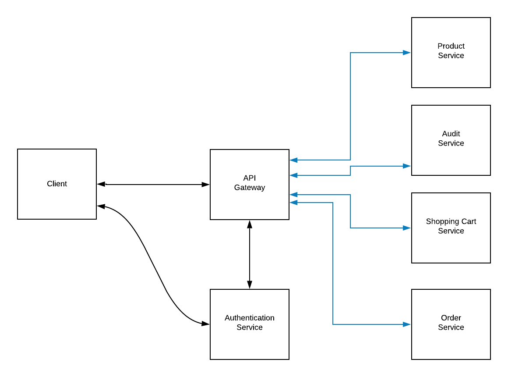

# icommerce
Simple online shopping application to sell products (backend only)
## System Design

### 1. Requirement clarification
A small start-up named "iCommerce" wants to build a very simple online shopping application to sell their products. In order to get to the market quickly, they just want to build an MVP version with a very limited set of functionalities:
a. The application is simply a simple web page that shows all products on which customers can filter, short and search for products based on different criteria such as name, price, brand, colour etc.

b. All product prices are subject to change at any time and the company wants to keep track of it.

c. If a customer finds a product that they like, they can add it to their shopping cart and proceed to place an order.

d. For audit support, all customers' activities such as searching, filtering and viewing product's details need to be stored in the database. However, failure to store customer activity is completely transparent to customer and should have no impact to the activity itself.

e. Customer can login simply by clicking the button “Login with Facebook”. No further account registration is required.

f. No online payment is supported yet. Customer is required to pay by cash when the product got delivered.

### 2. High-level design
At a high-level, we need some following services (or components) to handle above requirements:

- **Product Service**: manages our products with CRUD operations. This service also provides the ability to allow user could filter, sort and search for products based on dynamic criteria.
- **Audit Service**: records all customers activities (filtering, sorting, viewing product detail).
- **Shopping Cart Service**: manages customers shopping carts with CRUD operations.
- **Order Service**: manages customer orders with CRUD operations.
- **Authentication Service**: authenticates customer, integrates with 3rd party identity platform like Facebook, Google...
- **API Gateway**: Route requests to multiple services using a single endpoint. This service allows us to expose multiple services on a single endpoint and route to the appropriate service based on the request.
### 3. Defining data model
In this part, we describes considerations for managing data in our architecture. For each service, we discuss data schema and datastore considerations.

In general, we follow the basic principle of microservices is that each service manages its own data. Two services should not share a data store.

#### Product Service
The Product service stores information about all of our product. The storage requirements for the Product are:
- Long-term storage.
- Read-heavy (it's common for ecommerce application because the traffic from users to view, search, sort product are always much higher than the traffic from administrators to update product's information).
- Structured data: Category, Product, Brand, ProductPriceHistory. 
- Need complex joins (for example, in the UI, maybe we have a menu with different categories, user could choose a category and then view all products in that category, then each product will have many different variants like a T-shirt will have many different sizes and colors).

A relational database is appropriate in our case. For the simplicity of the assignment, we simplify the data schema like this:

Schema

#### Audit Service
The Audit service listens for customer activities from the Product service. The storage requirements for the Audit service are:
- Long-term storage.
- Able to handle massive amount a data ()
#### Shopping Cart Service
#### Order Service
The Order service stores information about all of our customer orders. The storage requirements for the Order are:
- Long-term storage.
- Able to handle a high volume of packages, requiring high write throughput (for example, we could have some big sale period in a year like 11/11 and 12/12, a lot of customers come to our system and make orders).
- Support simple queries like query by Order ID, query by customer. No complex joins or requirements for referential integrity.

Because the order data is simple and not relational, a document-oriented database is appropriate, and MongoDB can achieve high throughput and scale well in terms of volume of traffic or size of data (or both).

Schema
### 4. Detailed design

### 5. Identifying and resolving bottlenecks
