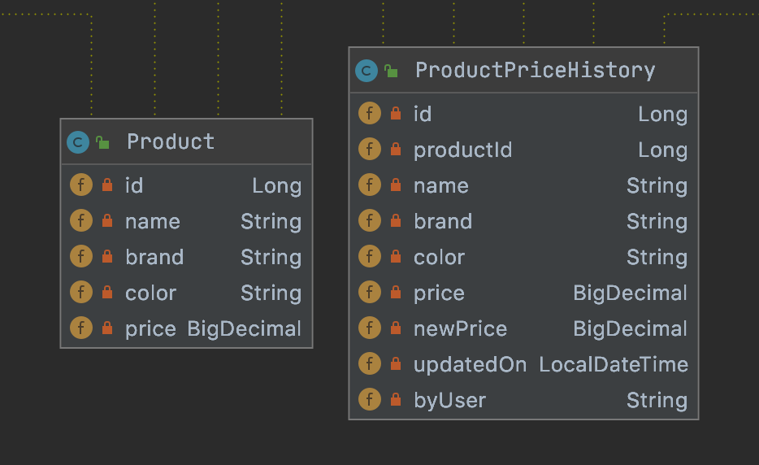
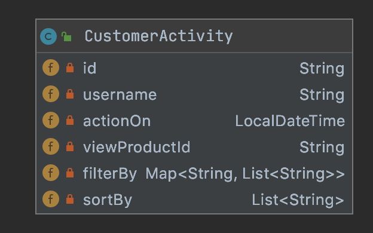
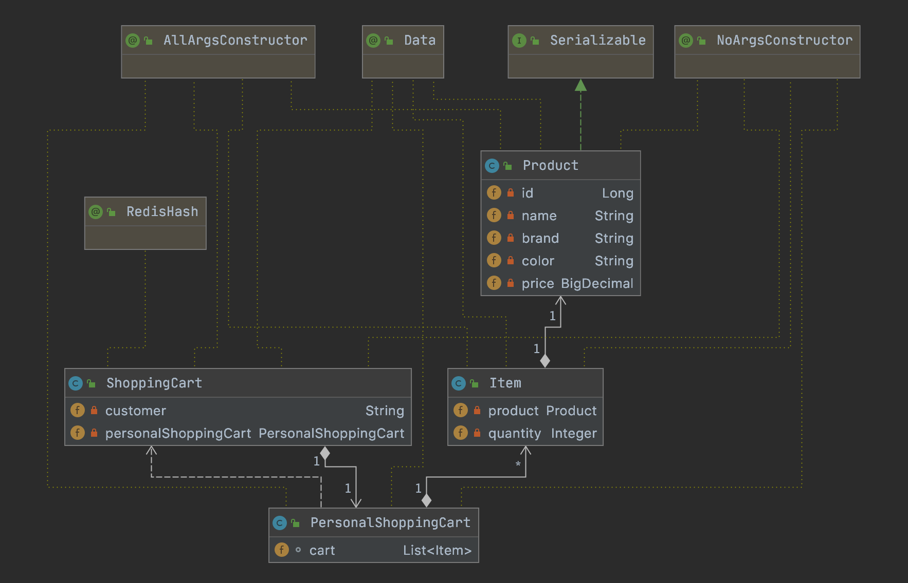
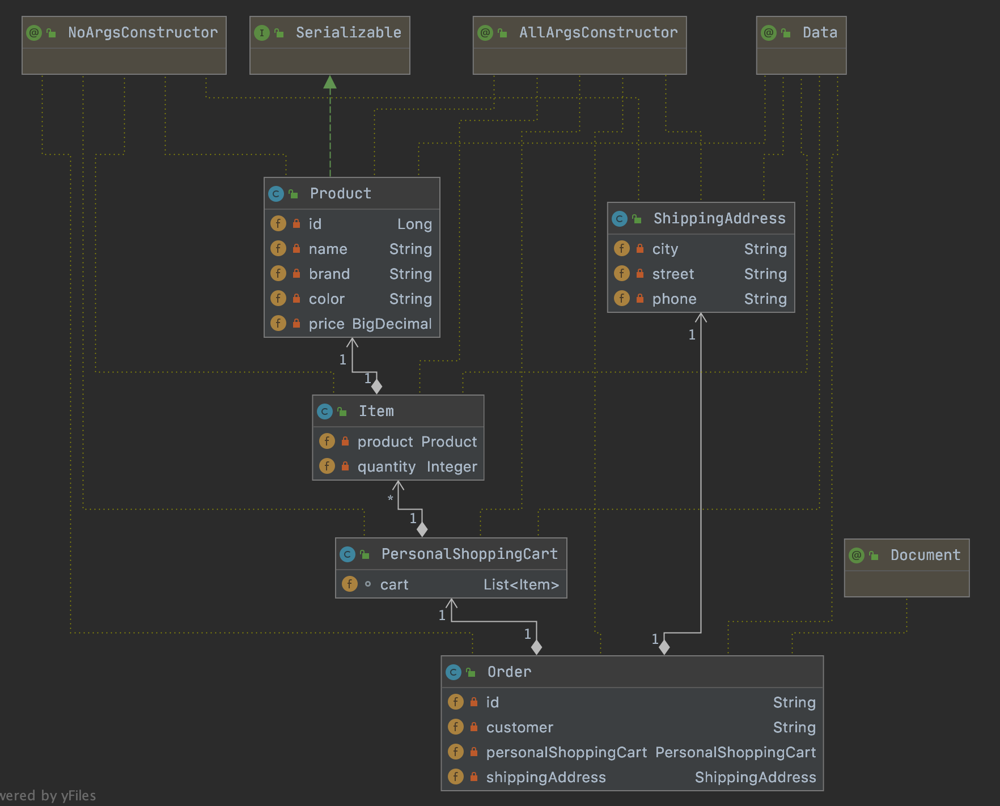
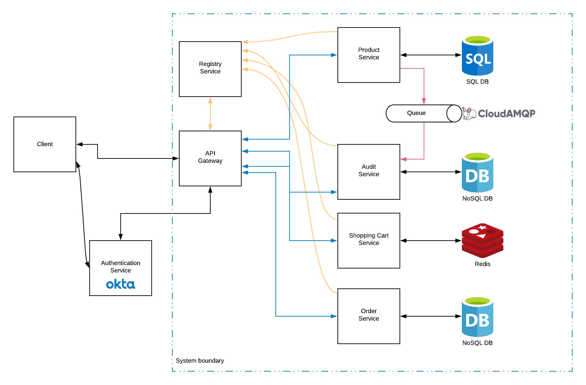
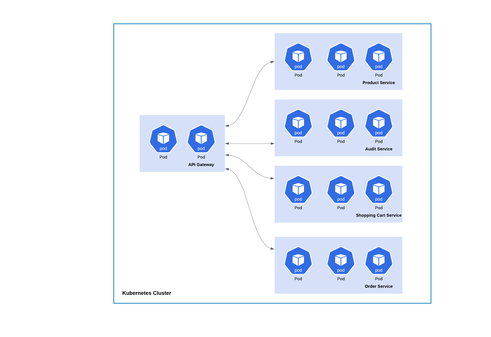

# icommerce
Simple online shopping application to sell products (backend only).

- [System Design](#system-design)
  * [1. Requirements](#1-requirements)
  * [2. High-level design](#2-high-level-design)
  * [3. Defining data model](#3-defining-data-model)
    + [Product Service](#product-service)
    + [Audit Service](#audit-service)
    + [Shopping Cart Service](#shopping-cart-service)
    + [Order Service](#order-service)
  * [4. Detailed design](#4-detailed-design)
    + [Authentication Service](#authentication-service)
    + [API Gateway](#api-gateway)
    + [Registry Service](#registry-service)
    + [Product Service](#product-service-1)
    + [Audit Service](#audit-service-1)
    + [Shopping Cart Service](#shopping-cart-service-1)
    + [Order Service](#order-service-1)
  * [5. Identifying and resolving bottlenecks](#5-identifying-and-resolving-bottlenecks)
- [Software development principles](#software-development-principles)
- [How to run the application](#how-to-run-the-application)
- [API Documentation](#api-documentation)
- [Project folder structure and Frameworks, Libraries](#project-folder-structure-and-frameworks-libraries)
  * [Project folder structure](#project-folder-structure)
  * [Frameworks and Libraries](#frameworks-and-libraries)

## System Design

### 1. Requirements
A small start-up named "iCommerce" wants to build a very simple online shopping application to sell their products. In order to get to the market quickly, they just want to build an MVP version with a very limited set of functionalities:
a. The application is simply a simple web page that shows all products on which customers can filter, short and search for products based on different criteria such as name, price, brand, colour etc.

b. All product prices are subject to change at any time and the company wants to keep track of it.

c. If a customer finds a product that they like, they can add it to their shopping cart and proceed to place an order.

d. For audit support, all customers' activities such as searching, filtering and viewing product's details need to be stored in the database. However, failure to store customer activity is completely transparent to customer and should have no impact to the activity itself.

e. Customer can login simply by clicking the button “Login with Facebook”. No further account registration is required.

f. No online payment is supported yet. Customer is required to pay by cash when the product got delivered.

### 2. High-level design
At a high-level, we need some following services (or components) to handle above requirements:

- **Product Service**: manages our products with CRUD operations. This service also provides the ability to allow user could filter, sort and search for products based on dynamic criteria.
- **Audit Service**: records all customers activities (filtering, sorting, viewing product detail).
- **Shopping Cart Service**: manages customers shopping carts with CRUD operations.
- **Order Service**: manages customer orders with CRUD operations.
- **Authentication Service**: authenticates customers, integrates with 3rd party identity platform like Facebook, Google...
- **API Gateway**: Route requests to multiple services using a single endpoint. This service allows us to expose multiple services on a single endpoint and route to the appropriate service based on the request.
### 3. Defining data model
In this part, we describes considerations for managing data in our architecture. For each service, we discuss data schema and datastore considerations.

In general, we follow the basic principle of microservices is that each service manages its own data. Two services should not share a data store.

#### Product Service
The Product service stores information about all of our product. The storage requirements for the Product are:
- Long-term storage.
- Read-heavy (it's common for ecommerce application because the traffic from users to view, search, sort product are always much higher than the traffic from administrators to update product's information).
- Structured data: Category, Product, Brand, ProductPriceHistory. 
- Need complex joins (for example, in the UI, maybe we have a menu with different categories, user could choose a category and then view all products in that category, then each product will have many different variants like a T-shirt will have many different sizes and colors).

A relational database is appropriate in our case. For the simplicity of the assignment, we simplify the data schema like this:

#### Audit Service
The Audit service listens for customer activities from the Product service. The storage requirements for the Audit service are:
- Long-term storage.
- Non-relational data.
- Able to handle massive amount a data (read-heavy as we mentioned in Product section above).
- Dynamic or flexible schema.

A document-oriented database is appropriate, and MongoDB is good fit in our scenario. It also supports to store Geolocation data and build-in queries to query data based on location -> it could help us if we want to know something like customers in which city will interest on which products (maybe for Product Recommendation Service).

We define the data schema like this:

#### Shopping Cart Service
The Shopping Cart service stores information about shopping cart of the customers. The storage requirements for the Shopping Cart Service are:
- Short-term storage. Each customer will have their own shopping cart and only one shopping cart at the moment. After customer checkout, the shopping cart data will be cleared.
- Need retrieve/lookup shopping cart data quickly and update shopping cart data quickly (for example, there are some big sale periods in a year like 11/11 and 12/12, a lot of customers come to our system and update their shopping cart data to make the order).
- Support only 1 simple query: query by customer.

The HashMap data structure (with the key is customer and the value is shopping cart data) seems meet our needs because the get and put operations take only constant time. But we will get the problem if the server running Shopping Cart Service goes down (we will lose all the shopping cart data of customers) or if we run many instances of Shopping Cart Service (we need to sync data between these instances). Redis could solve these problem easily and meets all our needs with its Hash Table high read-write performance with schema like this.

| Key (Customer) | Value (Shopping Cart data)       |
|--------------- |:--------------------------------:|
| Username       | List of Product and its quantity |
        

        
#### Order Service
The Order service stores information about all of our customer orders. The storage requirements for the Order are:
- Long-term storage.
- Able to handle a high volume of packages, requiring high write throughput (for example, there are some big sale periods in a year like 11/11 and 12/12, a lot of customers come to our system and make orders).
- Support simple queries. No complex joins or requirements for referential integrity.

Because the order data is simple and not relational, a document-oriented database is appropriate, and MongoDB can achieve high throughput and scale well in terms of volume of traffic or size of data (or both).

### 4. Detailed design

In this section, we go though all our services in detail.
#### Authentication Service
To simplify the setup, here we use [Okta](https://www.okta.com/products/customer-identity/authentication/) - an Identity Cloud Service, and it provides us some benefits:
- Single point to authenticate our customers: simplify our downstream microservice, these services just need to verify/validate the access token of users.
- Store data about our customer: In ecommerce application, we will need these data to send marketing/promotion emails...
- Perform almost popular social logins: Now we need support "Login with Facebook" only, but in the future maybe we need Google, LinkedIn...And we don't want to update all our downstream microservices to support more social logins. To simplify the process, we don't config Okta use Facebook Social Login, we login by username/password instead.
In the case we don't want to use cloud service, we could use Keycloak - an open source identity solution provides the same capacities.
#### API Gateway
We need API Gateway for following reasons:
- When a client needs to consume multiple services, setting up a separate endpoint for each service and having the client manage each endpoint can be challenging. Each service has a different API that the client must interact with, and the client must know about each endpoint in order to connect to the services. If an API changes, the client must be updated as well. If we refactor a service into two or more separate services, the code must change in both the service and the client.
- Simplify application development by moving shared service functionality, such as the use of SSL certificates, from other parts of the application into the gateway. Other common services such as authentication, authorization, logging, monitoring, or throttling can be difficult to implement and manage across a large number of deployments. It may be better to consolidate this type of functionality, in order to reduce overhead and the chance of errors. Simpler configuration results in easier management and scalability and makes service upgrades simpler.

- Provide some consistency for request and response logging and monitoring.
**Implementation:**
- We use *spring-boot-starter-security* and *spring-boot-starter-oauth2-resource-server* to mark this service as a *resource server*. We also need to indicate how our application can obtain the public key necessary to validate the signature of the JWTs it receives as Bearer tokens by setting spring.security.oauth2.resourceserver.jwt.jwk-set-uri to Okta service.
- We use *spring-cloud-netflix* to route the client request to our downstream services.
- When user successfully authenticated, we use ZuulFilter to add custom HTTP Header "Username" to client request. We could extract more information from JWT token (like user group - ADMIN, USER...) and add them as HTTP Header but for simplicity, we skip it for now.
#### Registry Service
We use *spring-cloud-starter-netflix-eureka-server* to start Eureka Server for service registration and discovery in our system. It helps API Gateway routing requests by service name instead of hard-code URL. But if we deploy our system to Kubernetes, we don't need this anymore because Kubernetes provides Service discovery and load balancing out-of-box.

#### Product Service
- To simplify the setup, our product service will use embded H2 database.
- To support customer filter, sort and search for products based on dynamic criterias, we have 2 options: *Spring Specification* and *QueryDSL*. Here we go with *QueryDSL* because it simplify the implementation.
- To keep track all customer activity, we need to records all customer request parameters when client send GET request to our endpoint to view product detail or to filtering/sorting products. We use *Spring AOP* and define the PointCut to tell Spring which part of the code should be monitored, we also define Advice method to tell Spring how to record these parameters.
- To make sure failure to store customer activity is completely transparent to customer and should have no impact to the activity itself, we use *Spring Async* to run our AOP Advice in a separate thread.
- We use *Spring Cloud Stream* to send all customer activity data from Product Service to a message broker (to simplify the setup, here we use CloudAMQP - a cloud RabbitMQ service). In our case, Product Service acts as a message *Source*, and Audit Service acts as a message *Sink*. We don't want data will not be lost if Audit Service was temporary down, so we config queue as durable queue for guaranteed message delivery.
#### Audit Service
- Audit Service acts as a message Sink, it consumes and process message (message is customer activity in our case). And store to MongoDB.
#### Shopping Cart Service
- A simple CRUD service with *spring-boot-starter-data-redis* and backed by Redis.
#### Order Service
- A simple CRUD Service with *spring-boot-starter-data-rest* and backed by MongoDB. We use @RepositoryRestResource to expose resources without implementing controller/service.
### 5. Identifying and resolving bottlenecks
To be updated
## Software development principles
To be updated
## How to run the application
To be updated
## API Documentation
To be updated
## Project folder structure and Frameworks, Libraries
### Project folder structure
Based on above design, the project folder structure is organized following:
- api-gateway: API Gateway
- audit-service: Audit Service
- external-files: external files
- order-service: Order Service
- product-service: Product Service
- registry-service: Registry Service
- shopping-cart-service: Shopping Cart Service
### Frameworks and Libraries
The Frameworks/Libraries used in the project and their purposes:
- spring-cloud-starter-netflix-eureka-server : Eureka Server (Registry Service). This library allows services to find and communicate with each other without hard-coding hostname and port.
- spring-cloud-starter-netflix-eureka-client : Eureka Client, for registering the service with Service Registry.
- spring-cloud-starter-netflix-zuul : Zuul Proxy, turn our API Gateway into a reverse proxy.
- spring-boot-starter-oauth2-resource-server: Starter for using Spring Security's OAuth2 resource server features, turn our API Gateway into a resource server.
- spring-boot-starter-actuator : monitor and manage the application health.
- spring-boot-starter-web : for building REST API.
- spring-boot-starter-test : Starter for testing Spring Boot applications with libraries including JUnit, Hamcrest and Mockito.
- spring-boot-starter-aop : for aspect-oriented programming with Spring AOP and AspectJ. We use this feature for implementing the customer audit feature.
- spring-boot-starter-data-jpa: for using Spring Data JPA with Hibernate.
- spring-boot-starter-data-mongodb: Starter for using MongoDB document-oriented database and Spring Data MongoDB.
- spring-cloud-starter-stream-rabbit: Spring Cloud Starter Stream Rabbit, we use this to send and get message from RabbitMQ.
- spring-boot-starter-data-rest: Starter for exposing Spring Data repositories over REST using Spring Data REST.
- spring-boot-starter-data-redis: Starter for using Redis key-value data store with Spring Data Redis.
- spring-boot-starter-validation: for using Java Bean Validation with Hibernate Validator.
- spring-boot-starter-security: for using Spring Security.
- spring-security-test: for the testing Spring Security.
- modelmapper: to make object mapping easy, by automatically determining how one object model maps to another, based on conventions.
- QueryDSL: build dynamic queries.
